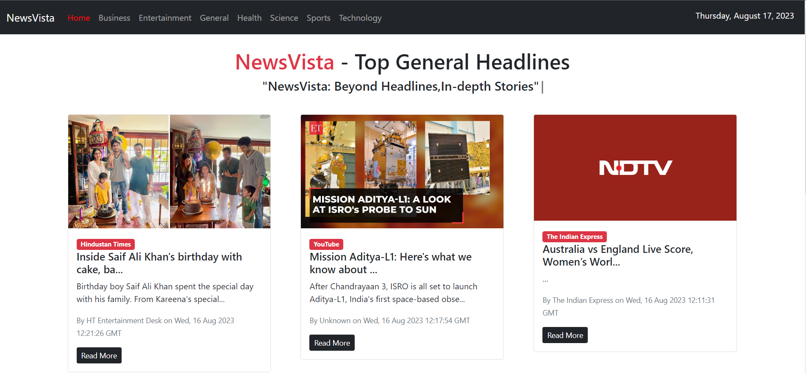
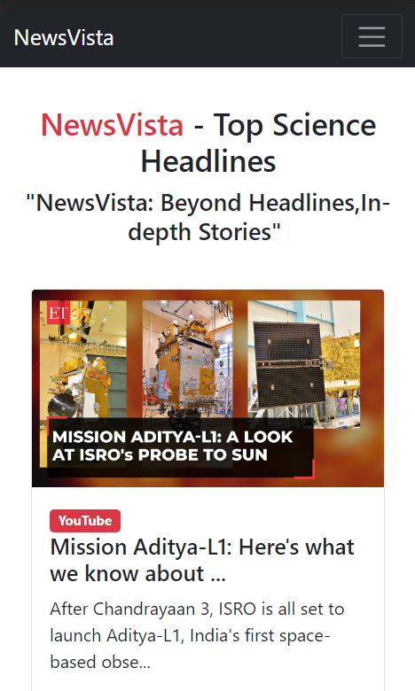

# NewsVista-React
News App created using React and NewsAPI.org
In the project directory, you can run:

### `npm start`

Runs the app in the development mode.
Open http://localhost:3000 to view it in the browser.

The page will reload if you make edits.

### install the packages used in the project
Go to the project directory in VsCode and run following commands in the terminal
1. Install React-router-Dom for travelling to different routes within app
 ### `npm i react-router-dom`

2. Install react top loading bar for showing loading effect in the news app
 ### `npm i react-top-loading-bar`

3. Install infinite scroll npm package to give app a fetch-loading effect
 ### `npm i react-infinite-scroll-component`

4. Install npm typewriter package for creating a typing effect in the app
 ### `npm i react-simple-typewriter`  
5. Read the documentation of newsapi to understand how api works and also create a env.local file in the project folder and paste your api key there to use the  app
 ### `REACT_APP_NEWS_API='paste your api key here'`
 ## Here is the basic preview of the app
 
 
 
## Thank you, Goodluck with the project
